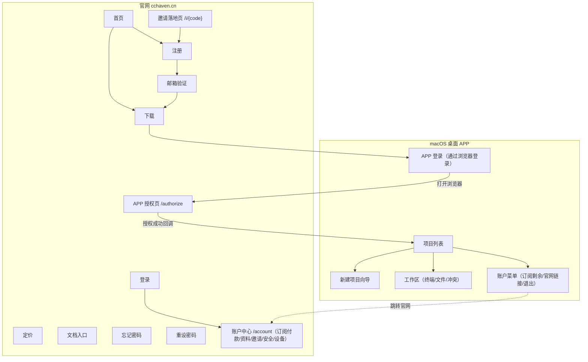
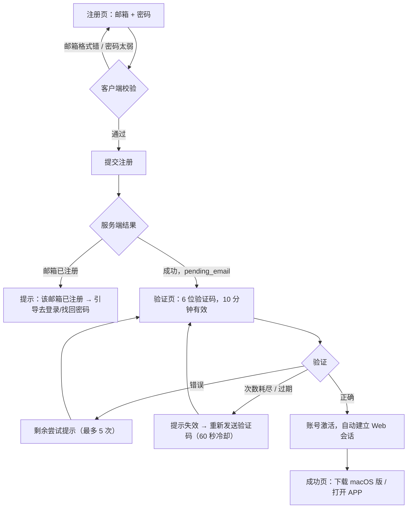
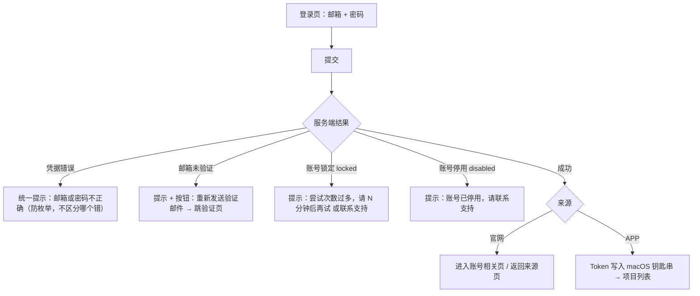
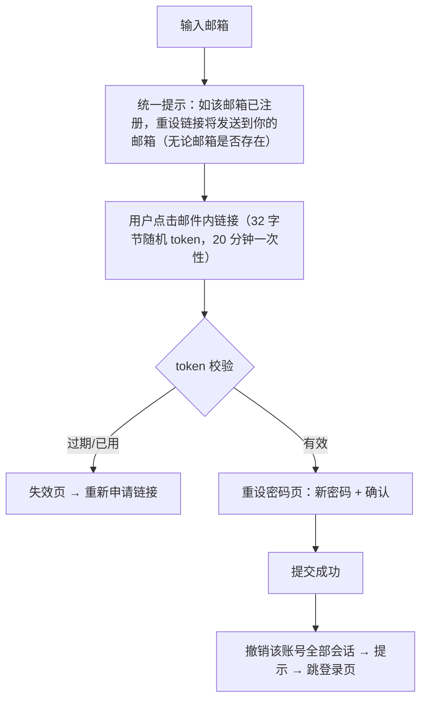
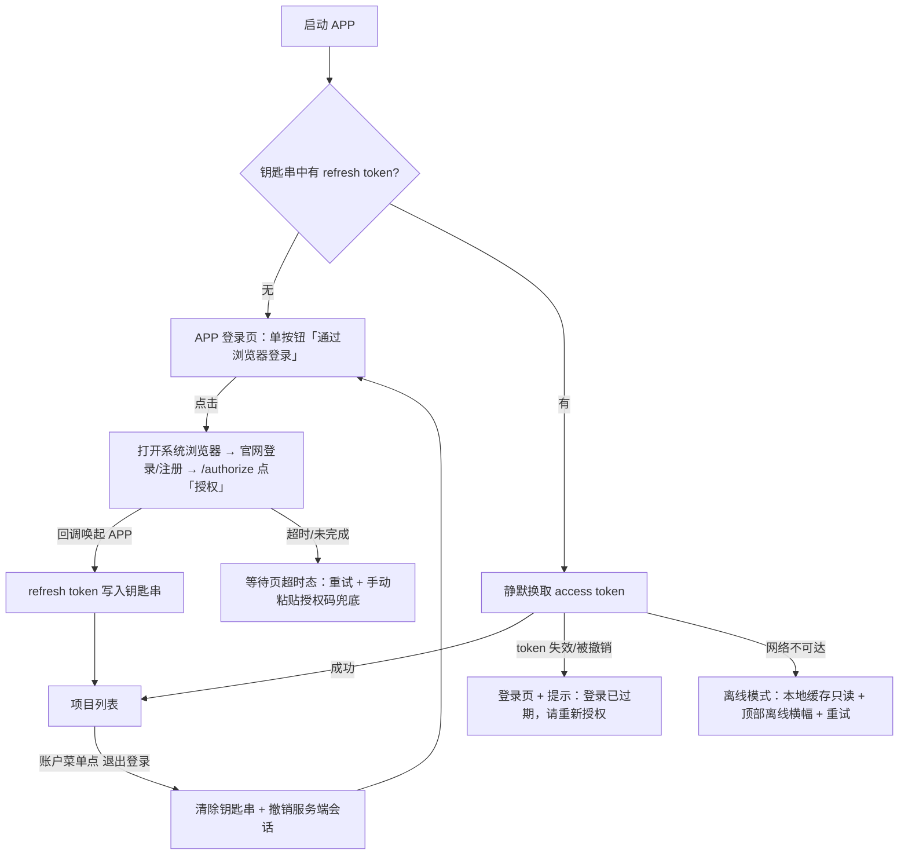
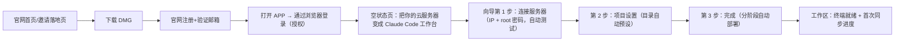
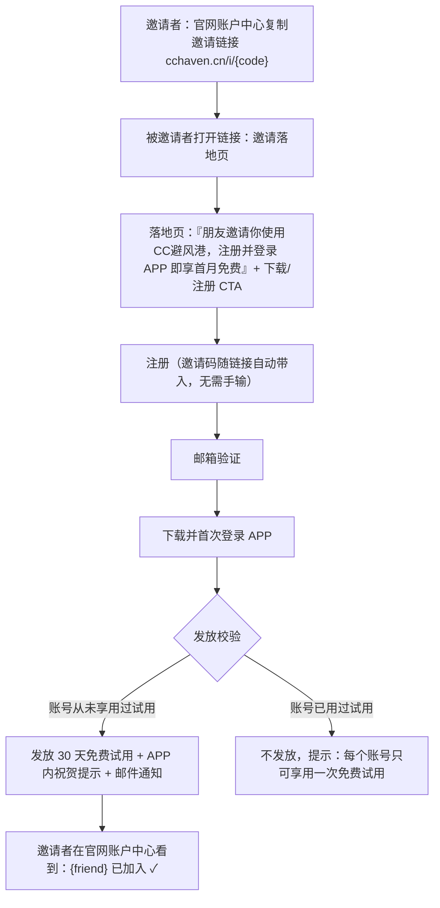

# CC避风港（CCHaven）交互设计文档

> **产品命名**：CC避风港（英文 CCHaven，演示域名 cchaven.cn）——目标用户圈内「CC」即 Claude Code 的通用简称，「避风港」直接传达「防封号的安全港」核心定位；刻意不使用「Claude」全称以规避 Anthropic 商标风险。替代原临时代号 FNS Workspace（仓库与内部 crate 命名不变）。

- 版本：v3（评审稿）
- 日期：2026-08-12
- 范围：官网（注册 / 登录 / 找回密码 / 下载 / 定价 / 邀请落地）+ macOS 桌面 APP（账号接入 + 现有工作区功能的交互完善）
- 账号方式：邮箱 + 密码 + 邮箱验证码（不含第三方登录）
- 界面语言：默认简体中文（zh-CN）；预留繁体中文（香港，zh-HK）切换；终端输出与代码保留英文
- 依据：`AI-Remote-Workspace` 产品化蓝图中的用户状态机与认证链路约束；现有桌面端实现（`apps/desktop/src/`）

---

## 1. 设计背景与原则

### 1.1 产品定位

**目标用户**：想使用 Claude Code、但容易被封号（或已被封号）的开发者。

**核心卖点（官网只讲两件事）**：

1. **防封方案**：Claude Code 运行在你自己的服务器上——独立环境、固定 IP、持久 tmux 会话，大幅降低封号风险；本机只是一块「遥控器 + 镜子」。
2. **双向安全同步**：远端改动实时回到本机，本机编辑实时上到服务器；机密文件默认不同步，冲突不会被静默覆盖。

**商业模式**：单一包月订阅——只有一个套餐，功能全开、无任何限制（不限工作区数量、不设配额档次）。

**增长机制**：邀请裂变——被邀请者通过邀请链接下载并完成注册登录后，获得**首月免费试用**；每个账号一生只可享用一次试用（详见 3.6 节）。

> 注：此定价形态取代蓝图中 Free/Pro/Team 多档套餐的建议；entitlement 机制仍可保留（只有「已订阅 / 试用中 / 未订阅」三种状态）。

### 1.2 设计原则

1. **开发者工具气质**：信息密度高、反馈直接、键盘友好；工作区延续深色终端风格，账号／官网使用干净的亮色。
2. **状态永远可见**：连接与同步状态是本产品的生命线，任何页面都能看到当前项目「已同步 / 同步中 / 离线 / 有冲突」。
3. **失败可恢复**：每一个错误提示必须附带下一步动作（重试、重发、重连、查看详情），不出现死胡同。
4. **安全默认**：防枚举文案、验证码限频、令牌入钥匙串、离线降级只读，全部作为默认行为而非可选项。
5. **五态完备**：每个页面／区块覆盖 loading / empty / error / disabled / 无权限 五种状态（蓝图 M06 验收要求）。

### 1.3 现状盘点（基于代码审阅）

| 现状 | 位置 | 问题 |
| --- | --- | --- |
| 无路由，`App.tsx` 用四个状态切换视图 | `apps/desktop/src/App.tsx` | 无法承载登录、账号中心等新页面，需引入路由 |
| 0 个项目时强制进入向导，取消无效 | `App.tsx:41` | 缺真正的空状态页；取消后仍回到向导 |
| Onboarding 无 SSH 连接测试 | `OnboardingWizard.tsx` | 部署失败才暴露连接问题，挫败感强 |
| 部署只有 “Deploying...” 单一状态 | `OnboardingWizard.tsx:61-88` | 上传／启动／首次同步多阶段不可见 |
| 冲突 Tab 为占位文本 | `WorkspaceView.tsx:55-59` | 冲突处理是核心承诺，需要完整交互 |
| 终端断开只打印 `[Connection closed]` | `Terminal.tsx:72-76` | 无重连按钮、无断因说明 |
| 无全局同步状态指示 | 全部 | 用户无法判断本机文件是否可信 |
| 项目不可编辑／删除 | `ProjectList.tsx` | 配置写错只能手动改配置文件 |
| 无任何账号界面 | 全部 | 本次设计的主体 |

---

## 2. 信息架构与站点地图

### 2.1 总体结构



### 2.2 官网站点地图

| 路径 | 页面 | 目的 |
| --- | --- | --- |
| `/` | 首页 | 30 秒讲清两件事：防封方案 + 双向安全同步；主 CTA「下载 macOS 版」 |
| `/i/{code}` | 邀请落地页 | 显示邀请人 + 首月免费说明 + 下载/注册 CTA；邀请码写入 cookie |
| `/pricing` | 定价 | 单一包月套餐 + 首月免费试用说明 + 常见问题 |
| `/download` | 下载 | macOS 下载按钮 + 系统要求 + 安装三步图 |
| `/docs` | 文档 | 跳转文档站（本次不设计内页） |
| `/signup` | 注册 | 邮箱 + 密码 → 邮箱验证码 |
| `/verify-email` | 邮箱验证 | 6 位验证码输入 + 重发 |
| `/login` | 登录 | 邮箱 + 密码 |
| `/forgot-password` | 忘记密码 | 输入邮箱，统一提示已发送 |
| `/reset-password?token=…` | 重设密码 | 邮件链接落地页，设置新密码 |
| `/account` | 账户中心 | 订阅与付款（续费/充值/发票）、个人资料、邀请好友、安全、登录设备与授权、注销；**所有账号管理与付款只在官网发生** |
| `/authorize?...` | APP 授权页 | APP 发起浏览器登录后的授权确认页（已登录则一键「授权」，未登录先走登录） |

### 2.3 桌面 APP 导航结构

引入轻量路由（视图层级如下），左侧常驻侧栏在登录后出现：

```text
未登录
└── 登录页（单按钮「通过浏览器登录」，APP 内无密码输入）

已登录
├── 侧栏（常驻）
│   ├── 项目列表（含同步状态点）
│   ├── + 新建项目 → 向导
│   └── 底部：全局同步状态条 + 账户入口（头像/邮箱/订阅剩余天数）
│       └── 点击弹出账户菜单（订阅有效期 · 管理订阅↗ · 邀请好友↗ · 文档↗ · 联系我们↗ · 退出登录）
├── 主区
│   ├── 空状态页（0 项目）
│   └── 工作区（终端 / 文件 / 冲突 三个 Tab）
└── 模态
    ├── 新建/编辑项目向导
    └── 删除项目确认
```

> APP 内**不做**账号管理页面：账户菜单只展示订阅还剩多久；充值续费、资料、邀请、安全、设备管理全部跳转官网 `/account` 完成。

---

## 3. 核心用户流程

### 3.1 注册与邮箱验证



要点：

- 注册成功即进入验证页，**不发放任何可用会话**（`pending_email` 状态只能重发验证或换邮箱）。
- 验证码输入采用 6 格自动跳位输入框，粘贴整段验证码自动填充，填满自动提交。
- 「重新发送验证码」60 秒倒计时冷却；重发不清空已过期提示。

### 3.2 登录（官网与 APP 共用逻辑）



### 3.3 忘记密码



### 3.4 桌面 APP 账号接入与会话生命周期

APP 内**不做密码输入**，登录走**浏览器授权**（OAuth 授权码 + 本机回环回调 / deep link，与 Cursor、GitHub Desktop 同模式）：APP 打开系统浏览器 → 用户在官网登录（或注册）→ 官网 `/authorize` 页点「授权」→ 浏览器回调唤起 APP，APP 换取 token。



- APP 登录页三个状态：**待发起**（单按钮 + 说明「应用本身不收集你的密码」）→ **等待授权**（spinner + 「已在浏览器中打开登录页…」+ 重新打开浏览器 / 取消）→ **超时**（错误条 + 重试 + 手动粘贴授权码兜底）。
- 好处：密码只在官网输入（防钓鱼、天然支持后续 2FA）；没有账号的用户在浏览器里顺路注册，不打断流程。
- 离线模式下：项目列表可见、文件浏览可用（缓存）、终端与同步禁用并说明原因。

### 3.5 首次使用旅程（端到端）



### 3.6 邀请裂变流程（首月免费试用）

规则：被邀请者经邀请链接**下载 + 注册 + 首次登录 APP** 三步全部完成后，才发放首月免费试用；**每个账号一生只可获得一次试用**（无论经何种途径）。



交互要点：

- 邀请码跟随链接与安装引导自动传递，被邀请者全程**无需手动输入邀请码**；注册页顶部显示邀请横幅确认资格。
- 试用发放时点为「首次登录 APP」，确保三步（下载、注册、登录）闭环后才发放，同时给邀请者明确的进度反馈（已注册／已登录）。
- 试用剩余天数常驻显示于 APP 账户菜单与官网账户中心订阅徽章：「免费试用中 · 剩余 23 天」；到期前 3 天 APP 内横幅提醒。
- 防滥用（后端规则，前端需配合展示拒绝文案）：同设备指纹／同支付资料重复领取则拒发，文案统一「每个账号只可享用一次免费试用。」
- **邀请者奖励**：每成功邀请 1 人（对方完成三步闭环），邀请者的订阅**延长 X 天**；X 由后台配置（可配 0 关闭该奖励），前端文案与天数一律从后台下发，不写死。奖励发放与被邀请者试用发放同一时点触发，并给邀请者 APP 内 toast +邮件通知「你邀请的 {friend} 已加入，订阅已延长 {X} 天」。

### 3.7 日常使用旅程

打开 APP → 钥匙串静默登录 → 项目列表（各项目带同步状态点）→ 选中项目 → 终端操作 Claude Code；期间：

- 文件变更由状态条实时反映（正在同步 N 个文件… → 已全部同步）。
- 出现冲突时「冲突」Tab 显示红色计数徽标，状态条变橙色，点击直达冲突列表。
- 连接断开时状态条变灰「离线」，自动重连（指数退避），也可手动「立即重连」。

---

## 4. 官网逐页交互说明

通用规格：亮色主题；顶栏 Logo「CC避风港 CCHaven」+ 定价 / 文档 / 下载 + 右侧「登录」/ 主按钮「免费开始」（已登录时替换为「账户」入口）；页脚含服务条款与隐私政策链接。响应式最小宽度 375px。终端示例保留英文。

### 4.1 首页 `/`（精简版，一屏半讲完）

**布局**（自上而下，只保留四块）：

1. Hero：主标题「安心使用 Claude Code，不再担心封号」+ 副标题「Claude Code 运行在你自己的服务器上，独立环境、固定 IP、持久会话；文件双向安全同步，编辑如同本机。」+ 主 CTA「下载 macOS 版」+ 次 CTA「查看定价」+ 产品截图（终端界面单张，不做切换）。
2. 两列价值点（只讲两件事）：
   - **防封方案**：独立服务器环境 + 固定 IP + 持久 tmux 会话，与本机环境完全隔离，降低封号风险；被中断也不丢上下文。
   - **双向安全同步**：远端改动实时回本机，本机编辑实时上服务器；机密文件（.env、密钥）默认永不同步；冲突并排对比，不静默覆盖。
3. 邀请横幅：「获朋友邀请？注册并登录 APP，即享首月免费试用。」（有邀请码 cookie 时高亮显示）
4. 定价摘要（单一包月卡片，一句「没有其他限制」）+ 底部下载 CTA。

删去：三列功能卡、工作原理示意图、功能介绍独立页（并入首页第 2 块，导航去掉「功能」项）。

**交互**：CTA 悬停微上浮；全页滚动一屏半内讲完，无轮播、无动画堆砌。

### 4.2 定价 `/pricing`

- **单一套餐卡片**（居中，宽 380px）：「CC避风港包月」+ 价格（从后台目录读取，页面不写死）+「每月 · 随时取消」+ 功能清单（防封服务器环境 / 双向安全同步 / 持久终端 / 不限工作区 / 邮件支持）+ 一句「没有其他限制，就一个价钱」。
- 卡片内 CTA：未登录「立即订阅」→ 跳 `/signup`；已订阅显示「已订阅」徽标；试用中显示「试用中 · 剩余 {n} 天」。
- 卡片下注明：「经朋友邀请注册并登录 APP，首月免费（每个账号限一次）。」
- 卡片下方常见问题手风琴（点击展开单项，同时只展开一项）。
- **五态**：loading 用一张骨架卡；价格请求失败显示重试块；无权限态不适用（公开页）。

### 4.3 下载 `/download`

- 主按钮「下载 macOS 版（Apple Silicon）」+ 次链接 Intel 版；显示版本号与更新日期。
- 下方三步安装引导（拖入「应用程序」文件夹 → 打开 → 登录）配图。
- 系统要求（macOS 13 及以上）；「已下载？打开 APP」提示。

### 4.4 邀请落地页 `/i/{code}`

- 居中卡片：礼物图标 + 「{邀请人} 邀请你使用CC避风港」+ 一句产品价值 + 加粗「注册并登录 APP，即享首月免费试用」。
- 主按钮「注册领取首月免费」→ `/signup`（邀请码已入 cookie）；次按钮「先下载 macOS 版」。
- 底部小字：「邀请码已自动记录，无需手动输入。每个账号只可享用一次免费试用。」
- 邀请码无效／过期：卡片替换为「此邀请链接已失效」+ 正常注册入口（不阻断转化）。

### 4.5 注册 `/signup`

**布局**：居中卡片（宽 400px），标题「创建账号」。

**邀请横幅**：带邀请码进入时，卡片顶部显示绿色横幅「🎁 {邀请人} 邀请你使用CC避风港 — 注册并登录 APP 即享首月免费试用」。邀请码随链接自动带入，无输入框。

| 元素 | 行为 |
| --- | --- |
| 邮箱输入框 | blur 时校验格式；错误 inline 显示「请输入有效的邮箱地址」 |
| 密码输入框 | 带显示／隐藏切换按钮；输入时实时显示强度条与规则清单（≥8 位、含字母和数字）；规则逐项打勾 |
| 主按钮「创建账号」 | 表单不完整时 disabled；提交中显示 spinner + 「创建中…」并禁用 |
| 底部链接 | 「已有账号？登录」 |
| 条款行 | 「继续即表示你同意服务条款及隐私政策」 |

**错误处理**：

- 邮箱已注册：inline 错误「该邮箱已注册。」+ 链接「登录」和「找回密码」。
- 频率限制：toast「尝试次数过多，请一分钟后再试。」
- 网络错误：表单顶部错误条 + 重试。

**五态**：loading（按钮 spinner）；error（如上）；disabled（按钮）；empty／无权限不适用。

### 4.6 邮箱验证 `/verify-email`

**布局**：居中卡片，标题「请查收邮件」，副文案「我们已向 {email} 发送 6 位验证码」（邮箱可点「更改」返回修改）。

| 元素 | 行为 |
| --- | --- |
| 6 格验证码输入 | 自动跳位；退格回退；粘贴自动分配；填满自动提交 |
| 重新发送验证码 | 初始 60 秒倒计时「42 秒后可重新发送」，冷却后可点；点击后重置倒计时并 toast「验证码已发送」 |
| 错误反馈 | 错误码：格子抖动 + 红边 + 「验证码不正确，还剩 3 次尝试机会。」；过期：「该验证码已过期。」+ 高亮重新发送 |
| 成功 | 卡片切换为成功态：对勾动画 + 「邮箱验证成功」+ 按钮「下载 macOS 版」/「打开CC避风港 APP」（尝试 deep link 唤起 APP） |

**五态**：loading（提交时格子只读 + spinner）；error（如上）；disabled（尝试耗尽后格子禁用，仅重发可用）；empty／无权限不适用。

### 4.7 登录 `/login`

- 布局同注册卡片；邮箱 + 密码 + 「忘记密码？」右对齐链接 + 主按钮「登录」+ 底部「新用户？创建账号」。
- 凭据错误统一 inline：「邮箱或密码不正确。」（不清空邮箱，只清空密码并聚焦）。
- 未验证邮箱：错误条「你的邮箱尚未验证。」+ 按钮「重新发送验证邮件」→ 跳 `/verify-email`。
- 锁定：「尝试次数过多，请 {N} 分钟后再试。」，按钮 disabled 至倒计时结束。

### 4.8 忘记密码 `/forgot-password` 与重设 `/reset-password`

- 忘记密码页：单一邮箱输入 + 按钮「发送重设链接」；提交后卡片整体切换为确认态：「如 {email} 已注册账号，你将很快收到重设链接。」+「返回登录」。60 秒内重复提交按钮冷却。
- 重设页（邮件链接落地）：token 校验中显示骨架；失效显示「该链接已过期或已被使用。」+ 按钮「重新申请链接」；有效则显示新密码 + 确认密码（同注册的强度反馈），提交成功后提示「密码已更新，所有设备已退出登录。」+ 3 秒后跳 `/login`。

---

## 5. 桌面 APP 逐页交互说明

通用规格：窗口最小 960×640；侧栏深色（#2c2c2c 系）延续现状；主区亮色，终端区深色。全键盘可达，Esc 关闭模态。

### 5.1 APP 登录页

**布局**：全窗居中卡片，Logo + 「登录」+ 单按钮「**通过浏览器登录 ↗**」+ 说明「将打开系统浏览器跳转到 cchaven.cn。没有账号？在浏览器里可以直接注册。应用本身不收集你的密码。」**APP 内没有邮箱/密码输入框。**

**行为（三状态）**：

- **待发起**：点击按钮打开系统浏览器（官网登录页，带 PKCE 授权参数）。
- **等待授权**：卡片切换为 spinner + 「已在浏览器中打开登录页。完成登录并点击『授权』后，这里会自动进入。」+ 按钮「重新打开浏览器」「取消」。
- **超时/失败**：错误条「等待授权超时。浏览器可能没有打开，或你尚未在浏览器中完成登录。」+「重试」；兜底说明可手动粘贴浏览器中的授权码。
- 授权成功：refresh token 存入 macOS 钥匙串（不落磁盘明文），过渡到项目列表。
- **邀请试用发放**：带邀请归因的账号首次授权成功时，弹出祝贺 toast「🎁 首月免费试用已开通，有效期至 {日期}」。
- 网络不可达：错误条「无法连接服务器。」+「重试」+ 链接「离线使用」（有本地缓存项目时才显示，进入只读离线模式）。

### 5.2 空状态页（0 个项目）

替代现状的「强制进入向导」：

- 主区居中插画 + 「把你的云服务器变成 Claude Code 工作台」+ 说明「只需要服务器的 IP 地址和密码，3 分钟完成设置。没有服务器也没关系，向导里有购买教程。」+ 主按钮「+ 新建项目」。
- 侧栏仍可用（账号入口可达），修复现状取消无效的问题：向导以模态出现，取消后回到空状态页。

### 5.3 新建／编辑项目向导（模态，三步，小白优先）

> 设计原则：目标用户可能完全不懂 SSH——他手里只有云厂商给的一个 IP 和 root 密码。所有 SSH 术语（端口、密钥、config）一律收进「高级选项」，默认路径零决策。

步骤名：连接服务器 → 项目设置 → 完成。

**第 1 步 — 连接服务器**

- 顶部帮助框（浅蓝）：「在阿里云、腾讯云、AWS 等平台买好服务器后，你会得到一个 IP 地址和 root 密码，填到下面就行，其余都交给我们。」+ 链接「还没有服务器？看购买教程 ↗」（图文教程《3 分钟买一台能跑 Claude Code 的服务器》）。
- 三个字段：**服务器 IP 地址**、**用户名**（预填 `root`，hint「新买的服务器一般就是 root」）、**密码**（hint「密码只保存在你自己的电脑上（系统钥匙串加密）」）。
- **粘贴识别**：IP 输入框支持直接粘贴整条 `ssh root@1.2.3.4 -p 2222` 或 `root@1.2.3.4`，自动拆填 IP／用户名／端口并 toast「已自动识别服务器地址和用户名」。
- **高级选项**（折叠，标注「懂 SSH 的用户使用」）：端口（默认 22）、认证方式切换为 SSH 密钥、从 `~/.ssh/config` 选择已有主机。
- 主按钮为「**连接并继续**」：点击即自动测试连接，成功显示绿条「✓ 连接成功！服务器环境正常（{发行版}）」并自动进入第 2 步——不再有独立的「测试连接」步骤让用户理解。
- 失败时显示**排查清单**（面向小白的红色错误条，按命中率排序）：① IP 是否照控制台抄对（公网 IP 非内网 IP）；② 密码是否正确（注意大小写，建议重新复制粘贴）；③ 云平台安全组/防火墙是否放行 {端口} 端口。附「查看图文排查教程 ↗」。

**第 2 步 — 项目设置**

- **项目名称**（hint「随便起，之后可以改」）。
- **服务器上的项目目录**：**自动预设，不需要用户填**——按登录用户推导：`root` → `/root/cchaven/{name}`，其他用户 → `/home/{user}/cchaven/{name}`。以只读预设行展示（灰底 + 绿色「已自动设置」标签 + 「修改」按钮），点「修改」才变输入框，可一键「用推荐值」还原。hint「目录不存在会自动创建，你不需要懂 Linux 路径」。
- **电脑上的同步文件夹**：同样自动预设 `~/CCHaven/{name}`，同样的预设行 + 修改交互。
- **高级选项**（折叠）：同步排除规则 textarea（预填 `.git/`、`node_modules/`、`target/`、`.env`）+ 固定提示「机密文件（.env、密钥）默认受保护，永不同步」（对应 `protectSecrets: true`）。

**第 3 步 — 完成**

- 摘要清单（服务器行带「✓ 已验证连接」，因第 1 步已强制测试）+ 说明「点『完成设置』后一切自动进行，大约需要 1 分钟」。
- 「完成设置」触发**分阶段进度**（阶段文案用人话，不出现 agent/tmux 术语）：
  1. 连接服务器
  2. 安装CC避风港同步组件（自动完成，无需操作）
  3. 创建项目目录 {remotePath}
  4. 首次同步（123/456 个文件）并启动 Claude Code 终端
- 每阶段行首 spinner→✓；失败停在该行，✗ + 人话错误（如「服务器磁盘空间不足（剩余 120 MB）。请清理磁盘后点击重试，或联系客服协助」）+「重试」从失败阶段续跑。
- 成功后模态自动关闭，直接进入该项目工作区（终端已就绪）。

### 5.4 侧栏与项目列表

- 每个项目行：名称 + 右侧 8px 状态点（绿=已同步，蓝脉冲=同步中，橙=有冲突，灰=离线）。
- 行悬停显示「…」菜单：编辑（打开向导预填）/ 在 Finder 显示 / 删除（二次确认模态，明确「不会删除任何本地或远端文件」）。
- 侧栏底部两块：
  - **全局同步状态条**：图标 + 文案（已全部同步 / 正在同步 3 个文件… / 2 个冲突 / 离线 — 5 秒后重试），点击展开最近同步活动的小面板。
  - **账户入口**：头像圆点 + 邮箱截断 + 第二行小字「已订阅 · 剩 {n} 天」；点击弹出**账户菜单**（见 5.6），不再进入独立账号中心页面。

### 5.5 工作区（终端 / 文件 / 冲突）

**顶部信息栏**（新增，位于 Tab 之上）：项目名 + 服务器芯片（`root@43.156.20.8`，等宽字体胶囊）+ 右侧连接状态（「已连接 · 已全部同步」绿色 / 「连接已断开」+ 重新连接按钮）+ 「打开本地文件夹」快捷按钮（小白最常用的动作：去 Finder 里看文件）。

**Tab 栏**：下划线式 Tab；「冲突」Tab 有冲突时显示红色数字徽标。

**终端**：

- 维持 xterm 交互；连接建立前显示居中 spinner「正在连接 {host}…」。
- 断开时终端上方浮出横幅：「连接已断开，5 秒后自动重连…［立即重连］」；自动重连成功后横幅变绿 2 秒后消失，tmux 会话保证上下文不丢失。
- 启动失败：终端区居中错误卡片（原因 + 重试 + 查看诊断）。

**文件**（VS Code 资源管理器式，双栏，是可操作的文件管理器而非只读浏览）：

- 左栏「资源管理器」：
  - 顶部小写标题「资源管理器」+ **项目根节点行**（项目名大写），hover 显示工具栏图标：新建文件 / 新建文件夹 / 刷新 / 全部折叠。
  - 目录树：文件夹 ▸/▾ 折叠展开 + **缩进参考线**；文件行 = 扩展名图标 + 文件名 + 右侧同步状态小图标（✓ 已同步绿 / ↑↓ 正在同步蓝 / ⚠ 有冲突橙，hover 显示文字说明）；排序文件夹在前。
  - **右键菜单**：文件——打开 / 重命名 / 复制路径 / 在 Finder 中显示 / 删除；文件夹——新建文件 / 新建文件夹 / 重命名 / 删除；空白处——新建文件 / 新建文件夹 / 刷新。
  - **新建/重命名为行内输入**（VS Code 同款）：树中出现输入行，Enter 确认、Esc 取消；创建/改名后立即标 ↑↓ 同步中并 toast「正在同步到服务器…」。
  - **删除**双端同步删除，toast 带 10 秒「撤销」。
- 右栏编辑器区：
  - **标签页**（打开的文件排成 Tab，活动 Tab 蓝色顶边，× 关闭；有冲突的文件 Tab 带 ⚠）。
  - 无打开文件时显示「**最近更新**」面板：按修改时间列出最近变更文件卡片（路径 + 相对时间 + 同步状态）——小白理解「同步在发生」的主入口。
  - 打开文件后：**面包屑**（项目名 › src › engine.rs）+ 元信息行（大小 · 修改时间 · 同步状态，冲突时附「去『冲突』页处理 →」）+ **带行号的代码视图** + 「复制路径」「用编辑器打开」。
- 五态：loading 骨架树；empty「尚未同步任何文件」；error 显示原因 + 重试；大文件（>1MB）预览显示「文件过大，无法预览」+ 用编辑器打开。

**冲突**（新设计，替代占位）：

- 左列冲突文件列表（路径 + 冲突时间 + 类型：双方修改 / 远端已删除等）。
- 右侧并排 Diff：本地（左）vs 远端（右），高亮差异行。
- 顶部操作条：「保留本地」「保留远端」「两者都保留（另存副本）」三按钮 + 「全部按…解决」批量下拉。
- 每次解决后列表项淡出，计数徽标同步减少；全部解决后显示空状态「没有冲突，已全部同步 ✓」。
- 解决动作可撤销（10 秒内 toast 带「撤销」，被覆盖版本先存入本地回收暂存）。

### 5.6 账户菜单（APP 内唯一账号界面）与官网账户中心

**设计原则**：APP 只负责「干活」，账号只在 APP 里体现为**一个弹出菜单**——用户唯一需要在 APP 里知道的账号信息是「订阅还剩多久」。其余（充值续费、资料、邀请、安全、设备）一律跳官网 `/account` 管理，付款绝不进 APP。

**APP 账户菜单**（点击侧栏底部账户入口，向上弹出，深色，Cursor 风格）：

- 头部：头像 + 邮箱 + 订阅状态行「已订阅 · 有效期至 {日期}（剩余 {n} 天）」或「免费试用中 · 剩余 {n} 天」。
- 菜单项（前四项均打开系统浏览器）：管理订阅与账号 ↗ ／ 邀请好友 ↗ ／ 使用文档 ↗ ／ 联系我们 ↗ ／ 分隔线 ／ 退出登录（清钥匙串 + 撤销服务端会话）。
- 到期提醒：试用/订阅剩余 ≤3 天时，账户入口第二行文字转橙色，APP 顶部出现一次性横幅「订阅即将到期，去官网续费 ↗」。
- 点击菜单外任意处关闭；无 loading/empty 态（数据随 token 刷新缓存于本地）。

**官网账户中心 `/account`**（登录态；APP 菜单跳转的落点，五个分区）：

- **订阅与付款**：订阅状态徽标（「已订阅 · 有效期至 {日期}（剩余 {n} 天）」／「免费试用中 · 剩余 {n} 天」／「未订阅」）+ 主按钮「续费 / 充值」（跳支付服务商托管页，站内不收集卡号）+ 说明「付款只在本页面完成，APP 内不处理、也不收集任何付款信息」。
- **个人资料**：邮箱（只读）+ 显示名称（可编辑，保存按钮）。
- **邀请好友**：
  - 邀请链接展示框 + 「复制链接」按钮（复制成功 toast「已复制邀请链接」）。
  - 说明文案（天数从后台配置读取）：「朋友经你的链接下载、注册并登录 APP 后，将获得首月免费试用（每个账号限一次）；每成功邀请 1 人，你的订阅延长 {X} 天。」后台将 X 配为 0 时，隐藏后半句。
  - 奖励汇总行：「已成功邀请 {n} 人 · 订阅共延长 {n×X} 天」（n=0 时隐藏）。
  - 邀请进度列表：好友邮箱（打码显示）+ 状态（已注册 / 已登录 ✓ 并标注「+{X} 天」）；空状态「还没有朋友加入」。
  - **五态**：loading 骨架；empty（如上）；error + 重试；复制按钮点击后 2 秒内显示「已复制 ✓」并暂时禁用；无权限不适用。
- **安全**：
  - 修改密码：当前密码 + 新密码（强度反馈同注册）；成功后 toast「密码已更新，其他设备已退出登录。」，其他会话被撤销、当前会话保留。
  - 修改邮箱：分两步——输入新邮箱 → 向新邮箱发验证码 → 验证成功后原子切换，原邮箱收到通知邮件。流程中可取消。
- **登录设备与授权**：
  - 列表包含浏览器会话与**经浏览器授权的 APP**（设备名 + 平台图标 + 最近活跃时间 + IP 归属地；当前会话标「本设备」）；说明「在这里退出即可撤销该设备的授权」。
  - 每行「退出该设备」按钮（二次确认）；底部「退出所有其他设备」。
  - 危险区：「退出登录」；「注销账号…」（7 天冷静期，期间可撤销）。
  - **五态**：loading 骨架行；empty（理论仅当前会话，列表恒非空）；error + 重试；撤销进行中按钮禁用；无权限不适用（本人数据）。

---

## 6. 全局交互规范

### 6.1 表单与校验

| 规则 | 说明 |
| --- | --- |
| 校验时机 | 输入框 blur 时做格式校验；提交时做全量校验；出错后该字段转为输入即校验（edit-to-clear） |
| 错误呈现 | 字段级错误一律 inline（红字 + 红边框，位于字段下方）；请求级错误用表单顶部错误条；跨页面／异步结果用 toast |
| 提交保护 | 提交中按钮 spinner + 禁用整个表单，防重复提交；网络超时 15 秒给出错误条 |
| 密码规则 | ≥8 位，须含字母与数字；强度条三档（弱／一般／强）；规则清单实时打勾 |

### 6.2 防枚举与限频文案（安全语义固定，不得随意改写）

| 场景 | 固定文案（zh-CN） |
| --- | --- |
| 登录失败 | 邮箱或密码不正确。 |
| 忘记密码提交后 | 如 {email} 已注册账号，你将很快收到重设链接。 |
| 验证码错误 | 验证码不正确，还剩 {n} 次尝试机会。 |
| 验证码过期 | 该验证码已过期，请重新发送。 |
| 限频 | 尝试次数过多，请 {n} {unit}后再试。 |
| 会话过期 | 登录已过期，请重新登录。 |
| 试用重复领取 | 每个账号只可享用一次免费试用。 |

验证码策略：6 位数字、10 分钟有效、最多 5 次尝试、60 秒重发冷却。重设链接：20 分钟、一次性。

### 6.3 连接与同步状态指示（全局唯一语义）

| 状态 | 颜色 | 图标／动效 | 文案 | 点击行为 |
| --- | --- | --- | --- | --- |
| 已同步 | 绿 | 实心圆 | 已全部同步 | 展开最近活动 |
| 同步中 | 蓝 | 圆点脉冲 | 正在同步 {n} 个文件… | 展开传输明细 |
| 有冲突 | 橙 | 三角叹号 | {n} 个冲突 | 直达「冲突」Tab |
| 离线 | 灰 | 断线图标 | 离线 — {n} 秒后重试 | 立即重连 |

重连策略：指数退避（2s→5s→10s→30s 封顶），任何时刻可手动「立即重连」；重连成功 toast「已恢复连接，继续同步…」。

### 6.4 反馈组件使用规则

- **Toast**：非阻断结果通知，4 秒自动消失，右上角，同类合并；带撤销的 toast 停留 10 秒。
- **模态**：仅用于向导、二次确认（删除项目、退出设备）与阻断性错误；一律可 Esc 关闭（部署进行中除外）。
- **错误条（banner）**：页面／表单级问题，常驻直到解决，必须附带动作按钮。
- **空状态**：插画／图标 + 一句说明 + 主行动按钮，不出现纯空白。

### 6.5 语言与本地化

- 界面文案：默认简体中文（zh-CN）；文案抽离为 i18n 字典，预留繁体中文（香港，zh-HK）等语言切换。
- 保留英文：CCHaven（与中文名「CC避风港」并用）、Claude Code、终端输出、代码、文件路径、技术缩写（SSH、tmux、token）。
- 价格与货币由后台套餐目录下发（页面不写死币种与数值）。
- 日期格式：YYYY年M月D日。

### 6.6 可访问性与响应式

- 全部交互元素可 Tab 聚焦，焦点环可见；模态内焦点圈定（focus trap）。
- 验证码输入支持屏幕阅读器逐格播报；状态点配文字标签不只靠颜色。
- 官网 375px 最小宽度不横向溢出；长邮箱、长项目名、长路径以中间省略号截断并 hover 显示全文。

---

## 7. 管理员运营后台（内部系统）

独立入口（如 `admin.cchaven.cn`），与官网、APP 完全隔离；管理员账号单独体系（邮箱 + 密码 + 强制 2FA），普通用户不可见。左侧深色侧栏导航（品牌 + 「运营后台 · 内部系统」标识），四个页面。

### 7.1 仪表盘（默认页）

- **核心指标卡**（六张）：今日日活 DAU（含较昨日环比）／今日新增注册（标注其中经邀请人数）／付费订阅用户（标注试用中人数）／今日收入（标注订单笔数）／试用→付费转化率（近 30 天）／7 日留存（含较上周变化，下降转橙色）。
- **近 7 日日活柱状图**：柱顶标数值，横轴日期，末位「今天」。
- **分布图**（横向占比条）：使用平台分布（macOS Apple Silicon / Intel，近 30 天活跃）；APP 版本分布（用于评估强制升级时机）；注册来源分布（自然流量 / 好友邀请 / 其他渠道，验证裂变效果）。
- 数据加载失败显示错误条 + 重试；指标缺数时该卡显示「—」而非 0，避免误读。

### 7.2 用户

- 工具栏：搜索框（邮箱 / 用户 ID）+ 订阅状态筛选 chips（全部 / 已订阅 / 试用中 / 未订阅 / 已禁用）。
- 表格列：**用户 ID**（注册号，等宽字体）／邮箱／注册时间／**来源**（自然流量 / 邀请（含邀请者 ID）/ 其他渠道）／**使用平台**（macOS 版本 + 芯片；未登录过 APP 显示「—」）／订阅状态徽标／最近活跃。
- 行操作：**禁用**（二次确认，明确「该用户将立即被登出且无法登录」；已禁用行变「解禁」）。
- 空搜索结果行内提示「没有匹配的用户」；加载失败错误条 + 重试。

### 7.3 订单与付款

- 工具栏：状态筛选 chips（全部 / 已支付 / 退款中 / 已退款 / 支付失败）+「导出 CSV」（按当前筛选导出）。
- 表格列：**订单号**（`CC{日期}-{序号}` 格式，附一键复制）／用户邮箱／金额／**支付渠道**（支付宝 / 微信支付 / 银行卡）／状态徽标／支付时间。
- 行操作：已支付订单可**退款**（二次确认 → 状态转「退款中」→ 完成后转「已退款」，全程 toast 反馈）。
- 页头常驻当日汇总：「今日 {n} 笔 · ¥{金额}」。

### 7.4 运营配置

前台文案与数值一律从此处下发，页面不写死（对应前文多处「后台可配置」）：

- **邀请裂变**：邀请者奖励天数 X（配 0 即关闭，前端相关文案自动隐藏）；被邀请者免费试用时长（默认 30 天）。
- **定价**：包月价格（官网定价页与账户中心从此读取）。
- 保存后 toast「配置已保存，官网与 APP 端实时生效」。

### 7.5 后台通用规范

- 所有破坏性操作（禁用用户、退款）必须二次确认，并留操作审计日志（操作人 + 时间 + 前后值）。
- 表格数据默认按时间倒序；金额右对齐；用户敏感信息（邮箱）在列表中打码显示，详情页需二次权限。
- 五态：每页覆盖 loading（骨架）/ empty（筛选无结果）/ error（错误条 + 重试）/ 操作进行中禁用 / 权限不足页（非管理员访问显示 403）。

---

## 附录 A：待后端确认的接口依赖

| 交互 | 依赖能力 |
| --- | --- |
| 注册/验证码/登录/找回 | 控制面 identity API（蓝图 M02/M03） |
| 登录设备列表与撤销 | session family 管理（M02-C） |
| 订阅状态（已订阅/试用中/未订阅） | 单一套餐的 entitlement snapshot |
| 邀请裂变 | 邀请码生成/归因、三步闭环事件（下载/注册/首次登录）、试用发放与「每账号一次」校验、防滥用规则 |
| 邀请者奖励 | 后台可配置的「每邀请 1 人延长 X 天」（X=0 关闭）、奖励发放事件、累计延长天数查询 |
| 分阶段部署进度 | agent 部署过程的阶段事件上报 |
| 同步状态条 | sync-core 的聚合状态事件（现有 `fns-sync-core` 已有状态机，需暴露给前端） |
| 冲突列表与解决 | 冲突读取 + 保留本地/远端/两者 三种 resolution 命令 |
| 运营后台 | 管理员账号体系（含 2FA）、DAU/注册/收入/留存聚合指标、用户列表与禁用、订单查询与退款（对接支付服务商）、运营配置读写、操作审计日志 |

## 附录 B：第二阶段原型范围

`design/prototype/`（Vite + React 独立应用）演示主链路：官网首页／邀请落地页 → 注册（含邀请横幅）→ 验证码 → APP「通过浏览器登录」授权（等待/超时态，含试用开通提示）→ 空状态 → 小白向导（IP+密码直连、粘贴 ssh 命令自动识别、目录自动预设、连接失败排查清单、分阶段部署）→ 工作区（顶部信息栏；终端/文件[VS Code 式资源管理器：新建/重命名/删除/右键菜单/标签页/最近更新]/冲突）→ APP 账户菜单（订阅剩余）→ 官网账户中心 `/#/account`（订阅付款/资料/邀请/安全/设备）→ 管理员运营后台 `/#/admin`（仪表盘/用户/订单与付款/运营配置）；悬浮条提供「显示错误状态」开关用于评审五态覆盖。
