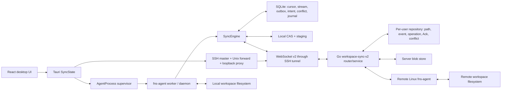
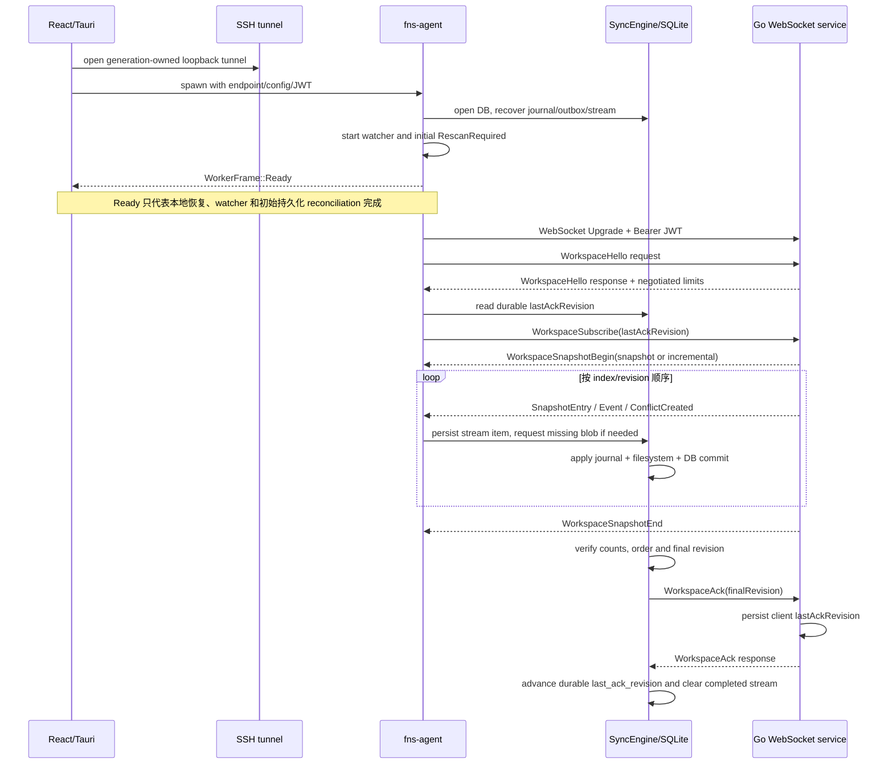
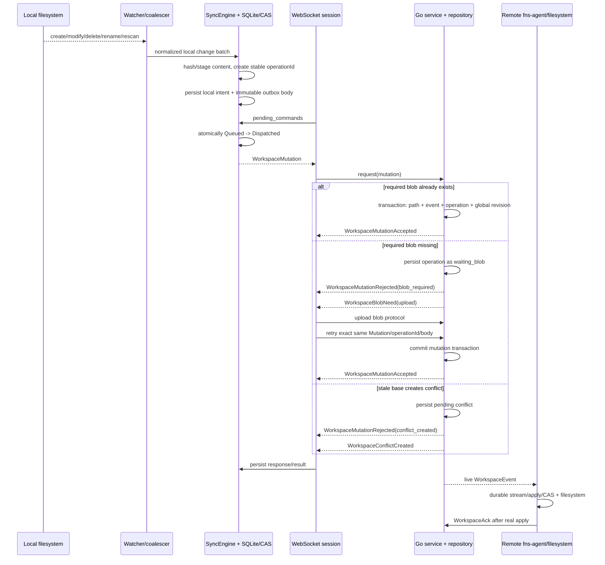
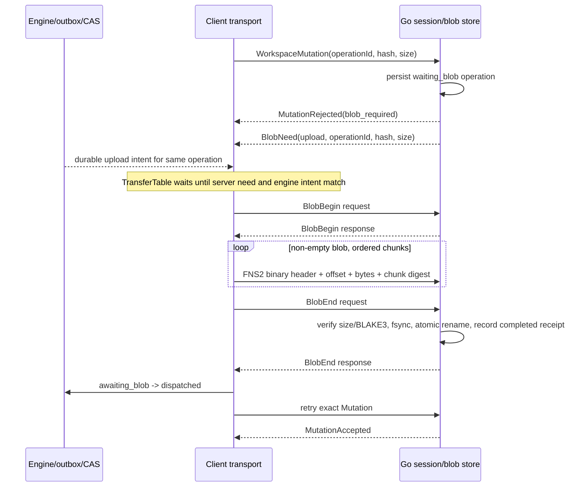

# FNS Workspace v2 同步事件链

> 状态：基于 2026-08-09 两个工作树的源码快照整理。两个工作树均有大量未提交改动；本文描述的是当前源码能力，不代表已经发布、部署或通过真实远端验收的版本。

## 1. 范围与结论

本文记录 FNS Workspace v2 的实际控制面、数据面、持久化边界和恢复语义，覆盖：

- SSH tunnel、WebSocket、`WorkspaceHello`、`WorkspaceSubscribe`、Snapshot、Event、Ack；
- Mutation、`WorkspaceBlobNeed`、`WorkspaceBlobBegin`、binary chunks、`WorkspaceBlobEnd`、Accepted、Rejected；
- 远端终端改动到本地文件系统落盘；
- 冲突创建、列出、解决以及权威 `ConflictResolved` 落盘；
- 重复消息、断线重连、Agent/App/服务端重启；
- 成功、失败、超时、取消和可观察性。

当前源码已经具备完整协议模型、SQLite/CAS、apply journal、outbox、冲突控制和双向 Agent 架构。但是，**当前工作树还不能据此宣称“完整版可用”**：运行态没有真正发布 `online`，健康检查与运行态指标不一致，且真实远端此前不是当前安全配置、远端 Agent 未运行，要求中的完整端到端矩阵尚无通过证据。

## 2. 实际组件与所有权



关键边界：

- Go 服务端不直接写远端工作目录。远端终端修改必须由远端 Linux `fns-agent` watcher 发现并上行；服务器事件也由该 Agent 下行落盘。
- 桌面端通过真实 credential provider 按 project 取 Bearer JWT，再建立 project generation 专属 SSH tunnel。JWT 放在 WebSocket HTTP Upgrade 的 `Authorization: Bearer ...` 中。
- WebSocket endpoint 只允许 loopback `ws://127.0.0.1:<port>/api/user/workspace-sync/v2`，公网链路由 SSH tunnel 承载。
- SyncEngine 是本地一致性所有者；SQLite 保存意图与进度，CAS 保存内容，apply journal 保证文件系统写入和数据库提交可恢复。
- Go repository 是远端 revision、path state、operation receipt、client Ack 和 conflict 的权威持久化所有者。

## 3. 启动、连接、订阅和 Ack



### 3.1 启动含义

1. Agent 先打开 SyncEngine。恢复过程中会处理未完成 apply journal、outbox、local intent、stream 和 CAS staging。
2. watcher 启动后立即提交一次 `RescanRequired`，把进程离线期间的文件变化重新协调进 durable outbox。
3. worker 随后发送 `WorkerFrame::Ready`。
4. WebSocket 网络循环在 Ready 之后独立运行。因此 Ready 和 Tauri 的 `running=true` **不证明** Hello、Subscribe、Snapshot、Ack 已完成，也不证明连接仍在线。

### 3.2 Hello 和 Subscribe

- 客户端发送方：`fns-transport::Session`。
- 服务端接收方：Go `ws_workspace_v2` session/router。
- Hello 是相关 request/response；客户端验证 protocol version、server version、frame/chunk/blob/transfer 限制和 heartbeat。
- 服务端在 Hello 前拒绝其他业务请求，并校验后续 Subscribe/Mutation/Ack/Resolve 的 `clientId` 与 Hello 一致。
- Subscribe 是 client request，但没有单独 response。客户端以首个 `WorkspaceSnapshotBegin` 作为订阅阶段成功信号。
- 服务端根据 durable `lastAckRevision` 选择：`0` 或低于 replay floor 时发 full snapshot，否则发连续 incremental revision items。
- Snapshot 期间的新 live event 暂存于有界队列；Go 侧队列满时以 WebSocket 1013 关闭，让客户端基于 Ack 重连重放。

### 3.3 Snapshot/Event 落盘与 Ack 条件

- `SnapshotBegin`、每个 entry/event/conflict 和 `SnapshotEnd` 都先记入本地 SQLite stream state。
- 文件或 symlink 所需 CAS 缺失时，stream item 保持 `waiting_blob`，不能提前 Ack。
- 目录和 tombstone 不需要 blob；文件内容通过 CAS 后进入 apply journal。
- apply journal 的阶段为 `prepared -> filesystem_started -> filesystem_applied -> database_committed -> finalized`。崩溃恢复按 durable 阶段继续或校正。
- 只有 stream 数量、index、revision 全部连续，所有 blob 完整校验，真实文件系统落盘和数据库提交都成功后，Engine 才设置 `pending_ack_revision`。
- 客户端发 `WorkspaceAck`；服务端把 client Ack 持久化后回响应。客户端收到相关成功响应才推进 `last_ack_revision` 并清理完成 stream。
- 服务端允许完全相同 Ack 重放；Ack 回退和超前均拒绝。

## 4. 本地文件到远端



### 4.1 watcher 与本地意图

- watcher 事件经 coalescer 合并；watcher gap、overflow 或关闭会触发全量 rescan，不静默假定状态完整。
- 普通创建、修改、删除、mkdir 和 rename 被规范化为 protocol mutation。
- 文件和 symlink 内容先稳定读取、计算 BLAKE3 并进入 CAS；目录、删除没有内容 blob。
- 空文件仍有内容 hash 和 size `0`，走 blob Begin/End，但没有 binary chunk。
- operation ID 一旦生成即稳定；outbox 保存不可变请求体及其 digest。进程重启、网络重连不能用新 ID 伪装同一操作。
- `Queued` 在出队发送前与 `Dispatched` 状态原子提交，避免“已经发出但数据库仍认为未发送”的窗口。

### 4.2 Accepted/Rejected

| 消息 | 发送方 -> 接收方 | 持久化与结算 | 失败后的恢复 |
| --- | --- | --- | --- |
| `WorkspaceMutation` | Agent -> Go | 客户端 outbox/local intent；服务端 operation request digest | 连接失败后用同 operation ID 和同 body 重发 |
| `WorkspaceMutationAccepted` | Go -> 发起 Agent | Go 已在同一写事务提交 path/event/operation/revision；客户端更新 path state、记录 applied receipt、删除对应 outbox | 响应丢失时服务端按 durable operation receipt 重放 terminal result |
| `WorkspaceMutationRejected(blob_required)` | Go -> 发起 Agent | Go operation 为 `waiting_blob`；客户端 outbox 为 `awaiting_blob` | 重连前客户端恢复为 `dispatched` 并重发 Mutation，由服务器重新决定是否仍需 blob |
| `WorkspaceMutationRejected(stale_base_revision)` | Go -> 发起 Agent | 客户端按服务器 current state 重新协调 | 产生新合法意图或转冲突；不得把旧 base 强行提交 |
| `WorkspaceMutationRejected(conflict_created)` | Go -> 发起 Agent | Go durable conflict；客户端 outbox 变 `blocked_conflict` 并保存 conflict | 等用户明确选择后提交 conflict resolution |
| `WorkspaceMutationRejected(operation_reused)` | Go -> 发起 Agent | 同 operation ID 对应不同 digest | 客户端视为协议/一致性错误，不能自动覆盖 |

## 5. Blob 上传与下载

### 5.1 上传：本地 CAS 到服务端 blob store



上传成功条件：chunk 顺序和 offset 连续、每块 digest 正确、总 size 正确、最终 BLAKE3 与 mutation hash 一致、服务端 staging fsync 并原子 rename 到最终 CAS。空文件跳过 chunk 循环。

### 5.2 下载：服务端 blob store 到本地 CAS

```mermaid
sequenceDiagram
    participant E as Engine/stream
    participant C as Client transport/staging
    participant S as Go session/blob store
    participant FS as Local filesystem

    E-->>C: stream item waiting_blob(hash, size)
    C->>S: BlobNeed(download)
    S-->>C: BlobNeed response(canonical size)
    S-->>C: BlobBegin push
    loop non-empty blob, ordered chunks
        S-->>C: FNS2 binary chunk
        C->>C: verify header/order/offset/chunk digest; write staging
    end
    S-->>C: BlobEnd push
    C->>C: verify total size and BLAKE3; seal staging
    C->>S: BlobEnd(download) request
    S-->>C: BlobEnd response
    C->>E: commit staging into local CAS
    E->>FS: resume apply journal and write real path
    E->>S: Ack only after filesystem + DB are stable
```

下载失败时 staging import 在 session 结束阶段统一 abort；已经提交的 CAS 内容可复用，未 seal 的 staging 不会冒充完整 blob。

### 5.3 重复 Blob

- 客户端在同一连接缓存 download Begin/End receipt；完全相同的重复 push 幂等忽略，字段变化的重复视为协议错误。
- Go 服务保存 completed transfer receipt，当前实现为进程内存、最多 4096 条、保留 30 分钟；完全相同的重复 End 可重放响应。
- Go 服务重启后旧 transfer ID receipt 不恢复。恢复依赖 durable waiting operation、已经原子提交的 CAS 和重新发送原 Mutation，而不是继续旧 transfer ID。
- chunk 不允许乱序、跳 offset 或 digest 改变；这些错误结束当前连接/transfer，不能部分接受。

## 6. 远端终端到本地真实落盘

```mermaid
sequenceDiagram
    participant RFS as Remote workspace filesystem
    participant RA as Remote fns-agent
    participant S as Go repository/blob store
    participant LA as Local desktop fns-agent
    participant LFS as Local workspace filesystem

    RFS-->>RA: terminal creates/modifies/deletes/renames
    RA->>RA: watcher/coalescer, CAS, durable outbox
    RA->>S: Mutation (+ blob upload when needed)
    S->>S: atomic path/event/operation/revision commit
    S-->>RA: Accepted
    S-->>LA: live Event (or replay after reconnect)
    LA->>LA: persist stream; download missing blob; apply journal
    LA->>LFS: mkdir/atomic write/rename/delete
    LA->>LA: commit path state and finalize journal
    LA->>S: Ack(revision)
```

验收时不能只看 WebSocket 日志或数据库。远端终端操作通过的必要证据是：

1. 远端 Agent watcher 确实产生 durable operation/outbox；
2. 服务端 operation、event 和 global revision 已提交；
3. 本地 Agent 收到对应 Event 或重连 replay；
4. blob（如有）的 size/hash 校验通过；
5. 本地目标路径实际存在/删除/重命名，内容、大小和 BLAKE3 与远端一致；
6. 本地 apply journal finalized，stream 完成，Ack 得到响应，outbox/pending intent 稳定归零。

## 7. 冲突创建、列出与解决

```mermaid
sequenceDiagram
    participant A as Agent A
    participant S as Go service
    participant B as Agent B / desktop UI
    participant E as SyncEngine/SQLite/filesystem

    A->>S: Mutation with stale base revision
    S->>S: create durable pending conflict
    S-->>A: MutationRejected(conflict_created)
    S-->>A: ConflictCreated push
    S-->>B: ConflictCreated push/replay
    B->>E: list_sync_conflicts
    E-->>B: persisted pending conflicts
    B->>E: resolve_sync_conflict(Current/Incoming/Merged/Delete)
    E->>E: persist stable resolution operation in outbox
    E->>S: ConflictResolved request
    opt merged blob absent on server
        S-->>E: BlobNeed(upload)
        E->>S: upload merged CAS blob; retry exact resolution
    end
    S->>S: commit resolution + path/event/new global revision
    S-->>E: related ConflictResolved response
    S-->>A: authoritative ConflictResolved push
    S-->>B: authoritative ConflictResolved push
    E->>E: apply selected state, clear conflict, then Ack
```

- UI 的 Conflicts 标签通过 Tauri `list_sync_conflicts` 和 `resolve_sync_conflict` 进入 session actor，再经 AgentProcess private IPC、worker、EngineHandle 到 SyncEngine。
- 支持 `Current`、`Incoming`、`Merged` 和 `Delete`。
- `Merged` 不把大内容穿过 React/Tauri RPC；Engine 读取用户当前本地冲突文件，计算 hash 并 stage 到 CAS。
- resolution 使用稳定 operation ID 并进入 durable outbox；缺 merged blob 时复用标准 BlobRequired 上传链。
- 相关 request success 只结算 resolution outbox。真正负责各 Agent 文件落盘、冲突清理、revision 和 Ack 的是权威 `ConflictResolved` push/replay。
- stale conflict revision 或 conflict not found 会标记 `refresh_required` 并重新 Subscribe，不能在旧视图上盲目覆盖。
- 完全相同 resolution 重试使用同 operation ID；同 ID 改变 choice/body 返回 `ConflictResolutionChanged`/operation reuse 类错误。

## 8. 消息责任矩阵

| 消息/帧 | 发送方 | 接收方 | durable 持久化方 | 谁确认 | 失败/超时/取消 |
| --- | --- | --- | --- | --- | --- |
| WebSocket Upgrade | Agent socket | Go router | token 不落同步库；连接态在内存 | HTTP 101 | 401/403 不升级；网络/upgrade timeout 进入重连；shutdown 取消 connect |
| `WorkspaceHello` | Agent request | Go session | 无业务状态 | Go related response | request timeout/非法 limits 结束 session；非 retryable 协议错误停止 |
| `WorkspaceSubscribe` | Agent request | Go service | Go 注册/校验 client；本地 last Ack 已在 SQLite | 首个 `SnapshotBegin` 是阶段确认 | subscribe deadline、gap、overflow 关闭并按 Ack 重连 |
| Snapshot Begin/Entry/End | Go push | Agent | 本地 SQLite stream + CAS + apply journal | 完成后由 Ack revision 确认 | index/count/revision/blob/apply 任一失败都不 Ack |
| `WorkspaceEvent` | Go push | 所有订阅 Agent | Go event/revision；本地 stream/path/journal | 落盘稳定后 Ack | 重复按 durable stream/path 状态协调；gap 触发 refresh/reconnect |
| `WorkspaceMutation` | Agent request | Go service | 客户端 outbox；Go operation/path/event/revision | Accepted 或 Rejected related response | timeout/断线重发同 operation；shutdown 关闭 socket，outbox 保留 |
| `BlobNeed(upload)` | Go push | 发起 Agent | Go waiting operation；客户端 awaiting_blob | 与 engine upload intent 匹配后 Begin | 两半不匹配、过期或 session 结束即 abort/重连 |
| `BlobBegin` | 上传时 Agent request；下载时 Go push | 对端 | transfer staging/内存状态 | 上传由 Go response；下载最终由客户端 End request | request/idle/lifetime timeout 结束 transfer/session |
| binary chunks | blob source | blob sink | staging file | 无逐块控制响应，最终 End 总校验 | 顺序/offset/chunk digest/size 错误即失败，不接受部分结果 |
| `BlobEnd` | 上传时 Agent request；下载时 Go push 后 Agent request | 对端 | seal 后 CAS；Go completed receipt 为内存态 | related End response | response 丢失可同连接 receipt 重放；跨重启重新协商 transfer |
| Accepted/Rejected | Go response | 发起 Agent | Go operation receipt；客户端 outbox/path/conflict | request tracker 相关匹配 | exact duplicate response 同连接忽略；变体复用 request ID 为协议错误 |
| `WorkspaceAck` | Agent request | Go service | Go workspace client row；本地 pending/last Ack | Go related Ack response | 超时重发；相同 Ack 幂等；回退/超前拒绝 |
| Conflict Created/Resolved | Go push（Resolved 也有 related response） | Agent/UI | Go conflict/operation/event；本地 conflict/stream/outbox | 权威 push 落盘后 Ack | stale/not-found 要 refresh Subscribe；不能只凭 related response 清本地文件状态 |

## 9. 重复、断线和重启恢复

| 场景 | 当前机制 | 验收关注点 |
| --- | --- | --- |
| 同连接重复 server response | client request tracker 记录 response；完全相同可忽略，不同 response 复用 ID 报协议错 | 不重复结算 outbox，不吞掉不一致响应 |
| 同连接重复 client request ID | Go 当前返回 `invalid_request`；不依 request ID 做业务幂等 | 正常重试应生成连接级 request ID，但保留业务 operation ID |
| 跨连接/Agent 重启重复 Mutation | operation `(clientId, operationId)` + body digest 在两端 durable；Go 重放 terminal receipt | revision 只增加一次，path/event 不重复，outbox 最终清空 |
| 断线时 `awaiting_blob` | `prepare_connection_attempt()` 把它恢复为 `dispatched`，重发原 Mutation | 由服务端 CAS/operation 状态重新决定 BlobRequired |
| 下载中断 | session 结束 abort 未完成 local staging import | CAS 不出现半文件；重连从 durable stream item 重新请求 |
| Snapshot 期间断线 | 本地 stream/cursor 持久化；Go 从 client last Ack replay | 未 Ack revision 必须重放，不得跳过或倒退 |
| live pending queue 丢失 | Go live queue 是连接内存；断线后依赖 global revision + last Ack replay | 连续 revision、无 gap，最终 Ack 达到 server head |
| 本地 Agent 重启 | SQLite 恢复 outbox/intent/stream/conflict/journal；启动 rescan | operation ID 不变，journal 最终 finalized，无重复文件操作副作用 |
| App 重启 | Tauri 重新建立 tunnel/Agent；Engine 从 state dir 恢复 | project/client/workspace identity 和 state dir 必须一致 |
| Go 服务重启 | repository、operation receipt、Ack、conflict、CAS 保留；连接/transfer receipt/live queue 丢失 | Mutation/Subscribe 重试收敛；不能依赖旧 transfer ID |
| watcher gap/overflow | 发出 `RescanRequired`，全量扫描重建本地差异 | 离线变化不丢，echo/dedup 不制造反向 mutation 风暴 |

网络重连由 Agent 内部指数退避调度，默认从 250 ms 增长到 30 s，并有 20% jitter。桌面层对 Agent 整进程失败另有最多 3 次重启，约 250 ms 到 5 s。所有 retry 都必须可由 shutdown cancellation 中断。

## 10. 超时、取消与可观察性

| 边界 | 成功 | 失败/超时 | 取消与清理 | 当前可观察性 |
| --- | --- | --- | --- | --- |
| SSH tunnel | master/control socket、Unix forward 和 loopback proxy 都就绪 | start/control/proxy/wait 有界失败码 | generation owner 显式 close；App 退出有界等待并保留未成功 reap 的所有权 | Tauri 返回稳定 tunnel error code |
| WebSocket connect/session | Upgrade、Hello、Subscribe 后持续收发 | connect/request/idle/transfer timeout；协议错误区分 retryable | cancellation 关闭 socket；session finally abort blob imports | Agent error code/log；但 runtime online 指标不可信，见缺口 |
| Agent private IPC | request ID 对应 RPC response | supervisor RPC 约 7 s；worker engine RPC 约 5 s | shutdown/fatal 会失败 pending RPC，不无限挂起 | Fatal/response 由单 stdout reader 分发 |
| Tauri sync actor | project generation 命令完成 | control request 约 10 s；进程失败最多有限重启 | stop/quit 关闭 Agent 和 tunnel；清理失败会返回而非静默 | UI 有 running/error/conflict，但 running 语义目前偏弱 |
| Filesystem apply | journal finalized，目标 path/hash/metadata 对齐 | I/O/hash/path validation 错误保留 journal/stream，不 Ack | 重启恢复 journal；不会把未完成 apply 当成功 | SQLite journal + stable engine error |
| Server transaction | path/event/operation/revision 原子提交 | validation/auth/repository/blob 错误返回稳定协议错误或关闭码 | context cancellation 中止未提交事务/staging | Go log + protocol response + durable receipt |

App 退出流程对 credential、sync 和 tunnel 做有界清理；清理失败会阻止“假成功退出”路径并返回稳定错误。后台任务和子进程不能只靠 Drop 假定已经停止。

## 11. 当前明确缺口与真实验收状态

当前工作树已修正此前的运行态阻断：Session 完整处理订阅 End 后发布 `Online`；daemon 从 Engine/Session/watcher 写入真实 Ack、pending、transfer 指标；首次 Online 会重置 reconnect schedule；deploy health 会核对 systemd MainPID、workspace、connected、Online、队列归零和错误状态。对应定向回归测试已经通过，但这些代码仍需随当前构建部署到真实远端后复验。

以下项目在当前部署证据下仍不能写成“已完成”：

1. Tauri 把 `WorkerFrame::Ready` 作为 Agent 启动成功，桌面 `running=true` 因此只证明本地恢复和 watcher 准备完成；真实在线证据应读取新的 runtime status，而不能继续只看 Ready。
2. deploy 代码包含 systemd 上传、配置、原子切换、进程身份健康检查和回滚，但当前工作树对应的真实远端部署仍需通过证据。
3. 此前远端体检发现运行服务使用了禁用认证的临时 patched 配置，且远端 Agent 未运行。源码中的真实 JWT 实现不等于远端现状已经合规；必须重新部署并以 401/403、有效 JWT Upgrade 和服务日志证明无绕过。
4. 文本、大文件、二进制、空文件、目录、嵌套目录、删除、重命名、并发修改、冲突、断线重连、远端 Agent 重启、本地 Agent/App 重启矩阵尚未全部在真实远端逐项核对 path/content/size/BLAKE3/revision/Ack/outbox/error state。
5. Go completed transfer receipt 不跨服务进程重启恢复；这是设计上的恢复边界，测试必须证明 CAS + durable operation replay 能收敛。
6. Go live pending queue 是连接内存态；必须通过真实断线回测证明 last Ack + revision replay 不丢事件。

因此，现阶段可准确表述为“核心双向同步和真实运行态实现已进入工作树，但可正常操作的远端验收版仍需完成部署和真实矩阵”，不能表述为完整版。

## 12. 完成验收必须留下的证据

每个矩阵用例至少记录：

- 本地和远端绝对路径；
- 文件类型、内容、字节大小、BLAKE3；目录树及 rename 前后不存在/存在关系；
- 发起 operation ID、base revision、服务端 committed revision；
- Mutation Accepted/Rejected、BlobNeed/Begin/End、Event、Ack 的时间线；
- 两端 SQLite 中 outbox、pending intent、stream、cursor、apply journal、conflict 的终态；
- 服务端 client Ack 和 workspace head；
- 断线/重启前后的 PID、连接 generation 和恢复日志；
- 认证：无 token、无效 token 的 401/403，以及有效 JWT 的成功 Upgrade；
- 后台 Agent、SSH master/proxy、测试进程全部有界退出，无孤儿进程。

只有真实远端终端创建的文件在本地出现、本地创建的文件在远端出现，并且上述状态最终稳定，才算双向同步通过。

## 13. 源码证据入口

客户端：

- `crates/fns-protocol/src/action.rs`
- `crates/fns-protocol/src/message.rs`
- `crates/fns-protocol/src/binary.rs`
- `crates/fns-transport/src/session.rs`
- `crates/fns-transport/src/dispatch.rs`
- `crates/fns-transport/src/transfer.rs`
- `crates/fns-transport/src/socket.rs`
- `crates/fns-transport/src/reconnect.rs`
- `crates/fns-sync-core/src/engine.rs`
- `crates/fns-sync-core/src/store.rs`
- `crates/fns-sync-core/src/model.rs`
- `crates/fns-sync-core/migrations/0002_applied_operation_receipts.sql`
- `crates/fns-sync-core/migrations/0003_provisional_mutation_acceptances.sql`
- `crates/fns-sync-core/migrations/0004_apply_journal_v2.sql`
- `bins/fns-agent/src/daemon.rs`
- `bins/fns-agent/src/worker.rs`
- `bins/fns-agent/src/supervisor.rs`
- `bins/fns-agent/src/protocol.rs`
- `apps/desktop/src-tauri/src/sync.rs`
- `apps/desktop/src-tauri/src/ssh_tunnel.rs`
- `apps/desktop/src-tauri/src/deploy.rs`
- `apps/desktop/src-tauri/src/credentials.rs`

服务端：

- `internal/routers/websocket_router/ws_workspace_v2.go`
- `internal/routers/websocket_router/workspace_v2_session.go`
- `internal/routers/websocket_router/workspace_v2_stream.go`
- `internal/routers/websocket_router/workspace_v2_blob.go`
- `internal/routers/websocket_router/workspace_v2_wire.go`
- `internal/service/workspace_sync.go`
- `internal/service/workspace_replay.go`
- `internal/service/workspace_conflict.go`
- `internal/service/workspace_blob_store.go`
- `internal/domain/domain_workspace.go`
