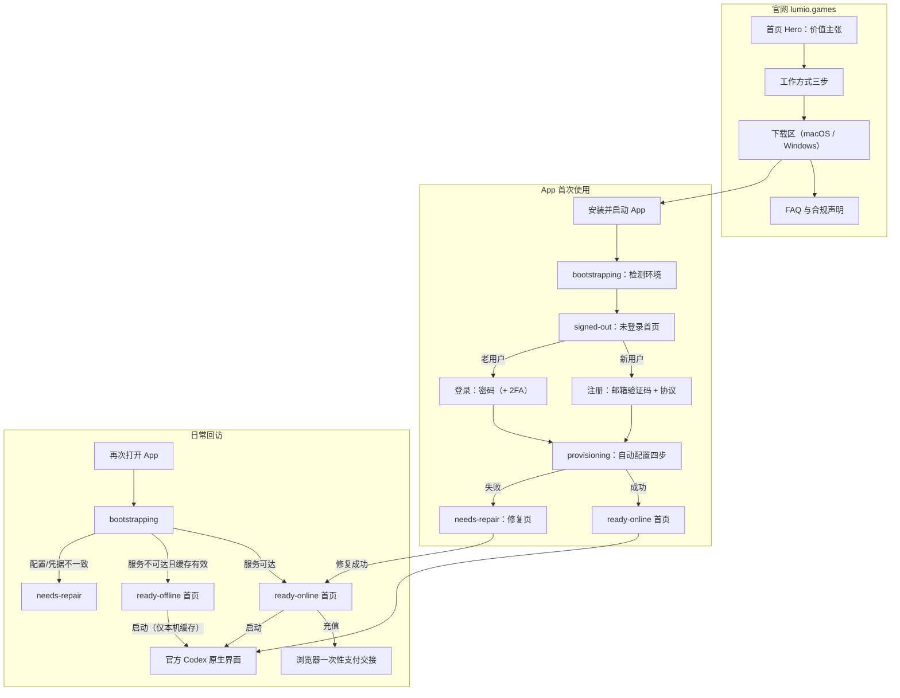
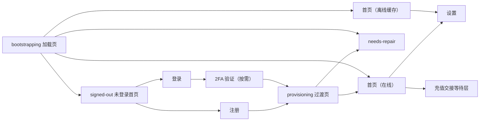

# Lumio Codex 交互设计（UX Interaction Design）

> 状态：设计稿 v1.1（2026-08-12；v1.1 依评审反馈加入「克制 / 品牌弱化 / 官方感优先」原则并同步全部文案与视觉基线）
> 关联文档：[2026-08-11-lumio-codex-branded-client-design.md](2026-08-11-lumio-codex-branded-client-design.md)（架构与规则定稿）、[docs/plans/2026-08-11-lumio-shell-branding.md](../plans/2026-08-11-lumio-shell-branding.md)（外壳实现计划）
> 可点击原型：`prototypes/lumio-ux/index.html`（纯静态假数据，见文末索引）

本文档定义 Lumio Codex 的完整交互方案，覆盖**官网**（品牌展示 + 下载引导）与**桌面 App**（注册、登录、自动配置、首页、充值交接、异常修复、设置）。所有账户与计费能力由 Sub2API 服务端提供；本设计不改变已定稿的架构规则，只补齐用户可见层的交互规格。

## 1. 设计原则

0. **克制：官方感优先（最高优先级）**：整体观感尽量还原官方 Codex 的克制风格，让用户感觉自己就是在用官方产品。落地规则：
   - **品牌弱化**：Lumio 品牌只出现在必要处（窗口标题、顶栏一处小字号品牌、页脚版本行）；不使用品牌渐变、极光、轨道动效等营销化视觉；logo 单色中性。
   - **色彩克制**：界面以灰阶为主，主按钮为中性浅色实底（官方风格），彩色只用于状态语义（成功 / 警示 / 错误）。
   - **文案克制**：所有面向用户的表述以「官方 Codex」为主语，本工具自称「接入工具 / 小工具」，不自我宣传。
   - **首屏定位声明**：官网 Hero 与 App 未登录首页的第一段文案必须说明——本工具仅为了让用户更快用上官方 Codex、减少安装配置步骤而存在；用户实际使用的始终是官方应用。
1. **零配置心智**：用户全程不接触任何底层连接概念；App 只呈现「登录 → 自动就绪 → 启动官方 Codex」三步心智。
2. **状态永远可解释**：8 个产品阶段（bootstrapping / signed-out / authenticating / provisioning / ready-online / ready-offline / needs-repair + 官网侧的未安装态）每个都有明确页面、明确文案、明确出口；禁用的按钮必须解释「为什么不可用」。
3. **服务端是唯一规则来源**：注册开关、邮箱后缀、协议版本、默认模型均来自服务端；客户端只做输入提示与必填校验，不本地写死业务规则。
4. **失败不装成功**：网络失败、验证失败、配置冲突一律给稳定错误码 + 可操作出口，不静默重试到底、不假装在线。
5. **秘密不上屏**：邮箱只在账户区展示；任何密钥、令牌不出现在 UI、URL、日志或原型文案中。

## 2. 用户旅程总图

关键旅程结论：

- 官网**不承载**注册 / 登录 / 充值，导航中没有账户入口；账户全部发生在 App 内，充值经 App 跳转系统浏览器完成。
- 注册与登录殊途同归，都汇入 provisioning；用户不需要理解「配置接管」，只看到一个带步骤说明的过渡页。
- 离线是一种**降级的正常态**而非错误：可启动、不可充值 / 刷新，页面必须解释原因和恢复方式。

## 3. 官网信息架构与交互

定位：**极简下载页**。单页滚动，只回答三个问题：这是什么（一句话）、怎么开始（三步）、去哪下载。不做营销区块。

### 3.1 页面结构（自上而下共五块）

| 区块 | 内容 | 交互 |
|------|------|------|
| 顶栏 | Logo + 产品名；「常见问题」锚点；「下载」主按钮 | 滚动吸顶 |
| Hero | 标题「更快开始使用官方 Codex」+ 一段定位声明（轻量接入工具，省去安装配置步骤，用的始终是官方 Codex）+ 单个下载 CTA | CTA 平滑滚动到下载区 |
| 三步开始 | ① 下载安装 ② 在 App 内登录 ③ 启动官方 Codex | 静态三卡，无跳转 |
| 下载区 | 三张平台卡（macOS Apple 芯片 / macOS Intel / Windows x64），内测警示直接写在区块副标题里 | 按 UA 标注「你的设备」；下载前弹未签名确认层 |
| FAQ + 页脚 | FAQ 只留三条：是官方应用吗（默认展开）/ 会修改官方 Codex 吗 / 在哪注册充值；页脚一段合规声明（AGPL、上游归属、商标、需单独安装官方应用） | FAQ 手风琴 |

### 3.2 精简原则

- 整站不出现「登录 / 注册」入口，账户操作全部指向 App。
- 不设价值宣传区：产品解释压缩为 Hero 的一段话，能删的营销文案一律删。
- 下载按钮就叫「下载」；未签名期间点击先弹确认层（macOS 右键打开 / Windows SmartScreen 提示），确认后跳发布页。

## 4. App 信息架构与导航框架

窗口框架沿用已实现的 `LumioApp` 三段式：顶栏（品牌 + 主导航 + 阶段指示灯）/ 主区 / 底栏（渠道与版本）。

- **主导航**只有「首页」「设置」两项；注册 / 登录 / provisioning / 修复页是**阶段页**，占据主区、隐藏主导航切换（顶栏仍在，阶段灯同步），防止用户中途跳走造成状态错乱。登录后阶段页自动让位。
- **阶段指示灯**（顶栏右侧）文案与页面一一对应：正在检查本机环境 / 等待登录 / 正在验证账户 / 正在准备连接 / 服务连接正常 / 使用本机缓存 / 需要检查配置。
- 页面间转场：阶段推进用淡入（150ms）；同级切换（首页 ↔ 设置）无动画直切。

## 5. 逐页交互规格

每页给出：目的 / 布局 / 交互与状态 / 文案要点。文案为最终中文 copy 基线，允许在实现时微调标点。

### 5.1 未登录首页（signed-out）

- **目的**：第一屏就讲清定位（只是官方 Codex 的快速接入工具），把用户导向注册或登录。
- **布局**：左侧 Hero 文案 + 两个主按钮；右侧「我们的承诺」安静清单卡（不修改官方应用 / 配置可一键恢复 / 凭据由系统保护），不放品牌动效；底部三格状态条（账户状态 / 官方应用 / 服务入口）。
- **交互与状态**：
  - 主按钮两枚并列：「登录」（primary）、「创建账户」（secondary）。当服务端 `registration=false` 时，「创建账户」变为禁用态，下方注释「注册暂未开放」。
  - 服务不可达时：两个按钮均禁用，状态条「服务入口」变为警示色，文案「服务暂时不可用，稍后自动重试」；每 30s 自动重试一次公开设置，恢复后按钮解禁。
  - 状态条「官方应用」未检测到时显示「等待手动选择」，点击跳转设置页的官方应用路径行。
- **文案要点**：标题「更快开始使用官方 Codex。」首段即定位声明：「这个小工具只做一件事：帮你完成注册、登录和本机配置，省去手动安装配置的步骤。之后你使用的始终是官方 Codex 应用，一切保持原生。」
- **脚注（凭据存储形态）**：承诺卡「凭据由系统保护」的说明文字必须与本期实际存储形态一致。本期凭据不落系统钥匙串 / 凭据管理器，而是存本机受限权限文件，见 `.spec/decisions/0001-lumio-credentials-local-file.md`；因此说明文字写「只保存在这台电脑上、仅你本人可读」，标题保持不变。若后续换成系统凭据库，需同步回改这句说明。

### 5.2 注册页

- **目的**：邮箱验证码注册，动态遵守服务端规则（注册开关 / 邮箱后缀 / 协议版本）。
- **布局**：居中单列窄卡（max-width 420px），从上到下：标题、邮箱、验证码（输入 + 发送按钮同行）、密码、确认密码、协议勾选组、提交按钮、底部「已有账户？去登录」。
- **交互与状态**：
  - **邮箱**：失焦校验格式；若服务端返回后缀白名单，输入域下方常驻提示「支持的邮箱：@xxx、@yyy」，不合规时输入框红边 + 行内错误「该邮箱后缀暂不支持」。
  - **发送验证码**：仅邮箱合法时可点；点击后进入 60s 倒计时（按钮文案「重新发送 (59s)」），期间禁用；发送失败按钮恢复并 toast 错误。验证码 6 位数字，自动过滤非数字。
  - **密码**：最少 8 位；输入时显示强度条（弱 / 中 / 强）；确认密码失焦比对，不一致行内报错「两次输入不一致」。
  - **协议勾选组**：逐条列出服务条款 / 隐私政策 / 使用政策（带服务端版本号，如「v2026-03」），每条独立勾选，标题可点击展开正文或外链；**全部勾选**前提交按钮禁用。
  - **提交**：按钮进入 loading（文案「正在创建账户…」）；成功直接进入 provisioning；失败在表单顶部显示错误横幅（见第 7 节错误映射），保留已填内容。
  - **注册关闭降级态**：整卡替换为说明面板「注册暂未开放」+ 服务端公告文案 +「返回登录」按钮；不渲染任何表单控件。
- **防重复提交**：提交中禁用全部输入；验证码错误不清空邮箱和密码。

### 5.3 登录页

- **目的**：邮箱 + 密码登录，按需 2FA，提供密码找回出口。
- **布局**：与注册页同构窄卡：标题、邮箱、密码（带可见性切换）、「忘记密码？」右对齐小链接、登录按钮、底部「没有账户？创建账户」。
- **交互与状态**：
  - 邮箱、密码非空才可提交；提交 loading 文案「正在验证…」。
  - **凭据错误**：顶部横幅「邮箱或密码不正确」，密码清空、邮箱保留、焦点回密码框。不提示「邮箱不存在」（防枚举）。
  - **2FA 步骤**：服务端要求时，卡片原位切换为第二步（不换页）：标题「输入两步验证码」、6 位分格输入（自动前进 / 退格回退 / 粘贴分发）、「返回重新登录」链接。验证码错误抖动 + 行内报错，输入清空。
  - **忘记密码**：弹出说明层「密码重置在网页端完成」，按钮「在浏览器中打开」跳转 Sub2API 站点重置页；App 不做重置表单。
  - **账号禁用 / 风控**：横幅显示服务端归一化文案 + 错误码，如「该账户已被停用（AUTH_ACCOUNT_DISABLED）」，附「联系支持」链接。
- **文案要点**：登录按钮就叫「登录」；2FA 步骤说明「打开你的验证器应用查看动态码」。

### 5.4 Provisioning 过渡页

- **目的**：把「刷新账户 → 准备连接 → 同步模型目录 → 写入本机配置」的后台过程翻译成用户可理解的进度，并承接失败分支。
- **布局**：居中垂直步骤列表，四步各有图标 + 标题 + 状态（等待 / 进行中 spinner / 完成 ✓ / 失败 ✕）；底部灰字「不需要手动操作，完成后自动进入首页」。
- **交互与状态**：
  - 步骤严格顺序执行；单步超过 10s 显示「比平时慢一些，仍在继续…」。
  - 全部完成后停留 600ms（让 ✓ 可感知）再进入首页。
  - **任一步失败**：该步标红，其余步骤停止；显示错误码 + 两个动作：「重试」（从失败步续跑）与「稍后处理」（登出回未登录首页）。连续两次失败后建议进入修复页。
  - 此页无返回按钮；关闭窗口再打开会从 bootstrapping 重新收敛，不产生半配置状态（底层保证原子写入）。
- **步骤文案**：① 验证账户 ② 准备连接 ③ 同步模型目录 ④ 写入本机配置。

### 5.5 首页（ready-online / ready-offline）

- **目的**：一屏回答「我是谁 / 我还有多少额度 / 连接正不正常 / 现在能干什么」。
- **布局**（沿用现有 dashboard）：欢迎行（邮箱 + 凭据保护徽章）→ 三张指标卡（余额与套餐 / 连接状态 / 默认模型）→ 行动面板（官方应用检测结果 + 「充值」「启动 Codex」按钮）。
- **在线态交互**：
  - 余额卡显示服务端最终数值 + 套餐摘要；点击卡片无跳转（充值统一走行动面板按钮）。
  - 连接状态卡显示「在线」+ 最近同步时间；提供「刷新」小按钮，点击后 spinner ≤ 3s，失败 toast「刷新失败，仍显示上次数据」。
  - 默认模型卡显示服务端下发模型名 + 「已配置」徽章；模型由服务端管理，无本地切换入口。
  - 「启动 Codex」：点击后按钮 loading ≤ 2s，成功后 toast「官方 Codex 已启动」，App 保持打开；未检测到官方应用时按钮禁用，注释「未检测到官方应用，去设置中选择」并链接设置页。
  - 「充值」：见 5.6。
- **离线态交互**：
  - 顶栏阶段灯切为「使用本机缓存」（琥珀色）；欢迎行下方加一条常驻信息条：「无法连接服务，正在使用 <时间> 的本机缓存。你仍可以启动官方 Codex。」
  - 余额卡数值降灰并标注「缓存值」；「充值」「刷新」禁用，悬停 tooltip「需要恢复网络连接」；「启动 Codex」保持可用。
  - 网络恢复由后台探测，成功后信息条变绿「已重新连接」3s 后消失，页面数据自动刷新。

### 5.6 充值交接（payment handoff）

- **目的**：把支付安全地交给系统浏览器，同时让 App 内的等待过程可控、可取消。
- **交互流程**：
  1. 点击「充值」→ 按钮 loading（创建一次性交接，≤ 2s）。
  2. 成功后系统浏览器打开支付页；App 内弹出模态等待卡：「已在浏览器中打开支付页面」+ 说明「完成支付后回到这里，余额会自动更新」+ 次要按钮「重新打开浏览器」与「关闭」。
  3. 等待卡存续期间后台轮询余额（10s 间隔）；检测到余额变动 → 卡片切换为成功态「余额已更新」+ 新余额，2s 后自动关闭。
  4. 交接链接 60s 有效：超时后「重新打开浏览器」会创建新的交接（旧链接自动失效），并提示「链接已更新，请使用最新打开的页面」。
  5. 用户点「关闭」仅关闭等待卡，不影响浏览器中的支付；支付完成后回 App 仍会通过常规刷新看到新余额。
  - **失败分支**：创建交接失败 → toast「暂时无法发起充值（PAYMENT_HANDOFF_CREATE_FAILED）」；浏览器打开失败 → 等待卡内显示可复制的链接兜底（链接只含一次性秘密，不含任何长期凭据）。

### 5.7 needs-repair 修复页

- **目的**：把「凭据 / 配置 / 快照不一致」翻译成用户能执行的三个动作，绝不静默覆盖用户配置。
- **布局**：警示图标 + 标题「需要检查配置」+ 一段话说明检测到的问题类型 + 错误码 chip + 动作区。
- **动作区**（按危险程度排序）：
  1. 「重新检查」（primary）：重跑一致性检测，进行中按钮 loading；通过则直接回首页。
  2. 「恢复本机配置」（secondary，警示色）：点击弹二次确认「恢复会把本机的 Codex 配置文件整份还原到 Lumio 接管前的状态：接管之后你在这个文件里做的修改都会丢失，包括你自己新增或改过的设置。」确认后执行并显示结果。本期恢复是整文件回滚，不是字段级撤销；设置页对应行的说明文案须与此一致。
  3. 「导出诊断日志」（tertiary）：说明「导出前会再次扫描并移除敏感内容」。
- **状态说明文案按错误域区分**：外部修改冲突 →「检测到本机配置被其他工具修改过」；凭据缺失 →「本机保存的登录凭据已失效，请重新登录」（此情形动作 1 替换为「重新登录」）。
- 修复失败时保留诊断信息与快照，显示「问题仍未解决」+ 重试；不提供任何「强制覆盖」按钮。

### 5.8 设置页

沿用已定稿的六项，补齐可用后的交互细节：

| 设置项 | 控件 | 交互细节 |
|--------|------|----------|
| 开机启动 | 开关 | 即点即生效；失败回弹 + toast 错误 |
| 自动更新 | 开关 | 关闭时下方出现灰字「你仍会收到重要安全更新提示」 |
| 官方应用路径 | 路径展示 + 「重新检测」按钮 | 检测中按钮 spinner；检测成功路径行绿色闪烁一次；失败保留原值 + 行内「未检测到，可手动选择」，出现「手动选择…」按钮打开系统文件选择器；选择的应用未通过结构校验时报错「所选应用无法识别为官方 Codex」 |
| 遥测 | 开关（默认关，本期禁用） | 本期无真实上报通道：开关保持禁用，下方灰字说明「使用数据收集尚未开放」。不得伪装为已开启。 |
| 日志导出 | 「导出」按钮 | 导出中 loading；完成后 toast「已导出到 <路径>」+「在访达 / 资源管理器中显示」 |
| 配置恢复 | 「恢复」按钮（警示色） | 与修复页动作 2 完全一致的二次确认与结果反馈；行说明写清「把配置文件还原到接管前的状态，接管后在这个文件里的修改会丢失」 |

页尾常驻一行安全说明：「不可用的选项会保持禁用，不会修改本机配置。」

## 6. 全局状态与反馈规范

- **加载**：≤ 300ms 的操作不显示 loading；300ms–3s 用按钮内 spinner；> 3s 或整页级用带文案的居中加载区（现有 `lumio-loading` 样式）。
- **Toast**：右上角，4s 自动消失，同类合并；错误 toast 附错误码后缀。一次只保留最新 3 条。
- **禁用态**：一律保留可见（不隐藏），并用注释或 tooltip 解释原因；这是「状态永远可解释」原则的落地。
- **错误横幅**：表单级错误置于卡片顶部，红色左边线 + 错误码；字段级错误紧跟字段，不用弹窗。
- **二次确认**：只用于不可逆或影响本机文件的动作（配置恢复、切换遥测开）；确认弹层必须写明影响范围与可逆性。
- **焦点与键盘**：表单回车提交；2FA 分格输入支持粘贴；所有弹层 Esc 关闭、焦点圈定。

## 7. 错误码 → 用户文案映射

服务端 / 客户端错误统一归一化为稳定错误码；UI 展示「人话 + 错误码 chip」。基线映射：

| 错误码 | 用户文案 | 出现位置 / 出口 |
|--------|----------|----------------|
| `AUTH_INVALID_CREDENTIALS` | 邮箱或密码不正确 | 登录横幅；清空密码 |
| `AUTH_CODE_INVALID` | 验证码不正确或已过期 | 注册行内；可重发 |
| `AUTH_CODE_REQUIRED` | 请先获取邮箱验证码 | 注册行内；聚焦验证码字段 |
| `AUTH_CODE_RATE_LIMITED` | 发送太频繁，请稍后再试 | 注册 toast；按钮维持倒计时 |
| `AUTH_EMAIL_DOMAIN_NOT_ALLOWED` | 该邮箱后缀暂不支持 | 注册行内 |
| `AUTH_EMAIL_INVALID` | 请填写有效的邮箱地址 | 注册 / 登录行内；聚焦邮箱字段 |
| `AUTH_EMAIL_ALREADY_REGISTERED` | 该邮箱已注册，请直接登录 | 注册行内 + 转登录入口 |
| `AUTH_INVITATION_CODE_REQUIRED` | 注册需要邀请码，请填写后重试 | 注册行内；展开并聚焦邀请码字段 |
| `AUTH_INVITATION_CODE_INVALID` | 邀请码无效或已被使用 | 注册行内；清空邀请码字段 |
| `AUTH_REGISTRATION_CLOSED` | 注册暂未开放 | 注册页降级态 |
| `AUTH_2FA_INVALID` | 两步验证码不正确 | 2FA 行内；清空输入 |
| `AUTH_2FA_UNAVAILABLE` | 两步验证当前不可用，请联系支持 | 2FA 横幅 + 联系支持 |
| `AUTH_ACCOUNT_DISABLED` | 该账户已被停用 | 登录横幅 + 联系支持 |
| `AUTH_SESSION_EXPIRED` | 登录已过期，请重新登录 | 全局 toast → 回登录页 |
| `KEY_PROVISION_FAILED` | 连接初始化失败，可重试 | provisioning 第 2 步失败态 |
| `KEY_STORAGE_UNAVAILABLE` | 无法访问系统安全存储 | provisioning / 修复页 |
| `SERVICE_UNAVAILABLE` | 服务暂时不可用，稍后自动重试 | 未登录首页 / 首页信息条 |
| `SERVICE_RATE_LIMITED` | 请求过于频繁，请稍后再试 | 全局 toast；退避后重试 |
| `SERVICE_VERSION_TOO_OLD` | 当前版本过旧，请更新后继续 | 全局阻断条 + 更新入口（已登录可离线启动） |
| `CODEX_APP_NOT_FOUND` | 未检测到官方应用 | 首页行动面板 / 设置 |
| `CODEX_APP_INVALID` | 所选应用无法识别为官方 Codex | 设置手动选择 |
| `CODEX_CONFIG_CONFLICT` | 检测到本机配置被其他工具修改过 | 修复页 |
| `CODEX_CONFIG_WRITE_FAILED` | 写入本机配置失败，已保留原始内容 | 修复页 / provisioning 第 3 步失败态 |
| `CODEX_RESTORE_FAILED` | 恢复未完成，已保留原始快照 | 修复页 / 设置 |
| `CODEX_LAUNCH_FAILED` | 启动官方 Codex 失败 | 首页 toast + 重试 |
| `PAYMENT_HANDOFF_CREATE_FAILED` | 暂时无法发起充值 | 充值 toast |
| `PAYMENT_HANDOFF_EXPIRED` | 支付链接已过期，请重新打开 | 等待卡内提示 |
| `UPDATE_VERIFY_FAILED` | 更新包校验未通过，已放弃安装 | 设置 / toast |

规则：新错误码先归入以上六个域再扩展；文案不出现技术内部词；同一错误码在所有页面使用同一句文案。

## 8. 可点击原型索引

原型位于 `prototypes/lumio-ux/`（纯静态 HTML/CSS/JS，双击 `index.html` 打开；有意放在 `docs/` 之外，避免被 GitHub Pages 发布）。每页右下角有「原型导航」浮层，可跳转任意页面与状态变体。

| 原型页 | 覆盖规格 | 状态变体 |
|--------|----------|----------|
| `index.html` | 总入口 / 站点地图 | — |
| `site/index.html` | 第 3 节官网全部区块 | 下载确认弹层 |
| `app/signed-out.html` | 5.1 | `#registration-closed` 注册关闭、`#service-down` 服务不可用 |
| `app/register.html` | 5.2 | `#closed` 注册关闭降级态；验证码倒计时、协议勾选、行内校验可交互 |
| `app/login.html` | 5.3 | 页内 2FA 步骤切换、`#error` 凭据错误、`#disabled` 账号停用 |
| `app/provisioning.html` | 5.4 | 自动播放四步进度；`#fail` 第 2 步失败态 |
| `app/home-online.html` | 5.5 在线态 + 5.6 | 充值等待卡（打开 / 成功 / 超时）、启动 toast |
| `app/home-offline.html` | 5.5 离线态 | 禁用解释 tooltip、重连恢复演示 |
| `app/repair.html` | 5.7 | 恢复二次确认弹层；`#credentials` 凭据失效变体 |
| `app/settings.html` | 5.8 | 开关交互、重新检测 spinner、遥测确认层、恢复二次确认 |

原型约束：不发任何网络请求；数据全部为写死的演示值；不出现任何被禁产品词（与 `shell-copy.test.ts` 的红线一致）。
